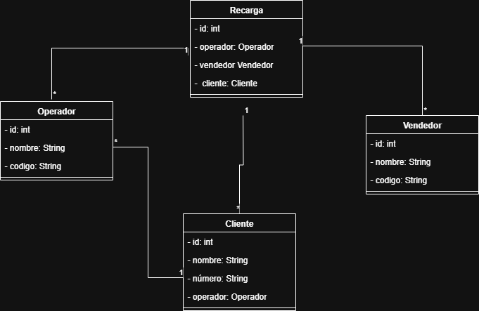

# 📱 Prueba Técnica - Sistema de Recargas

Este proyecto implementa un sistema básico de recargas telefónicas con **Spring Boot** y **Base de Datos Relacional**.  

La prueba incluye la definición de entidades: **Operador**, **Vendedor**, **Cliente** y **Recarga**, además de las relaciones entre ellas.

---

## 🏗️ Modelo de Datos

El modelo se basa en las siguientes tablas principales:

- **Operador**: Identifica las compañías de telefonía.
- **Vendedor**: Personas o puntos autorizados para realizar recargas.
- **Cliente**: Usuarios que reciben la recarga (número de celular único).
- **Recarga**: Transacciones que relacionan `codigo_operador`, `codigo_vendedor` y `numero_cliente`.

### 📊 Diagrama Entidad-Relación



---

## ⚙️ Requisitos Técnicos

- **Java 21** (Amazon Corretto recomendado)
- **Spring Boot 3.x**
- **Maven 3.9+**
- **Base de datos**: MySQL / PostgreSQL (configurable)
- **Git**

---

## 🚀 Ejecución

1. Clonar el repositorio:
   ```bash
   git clone https://github.com/tu-usuario/recargas-spring.git
   cd recargas-spring
